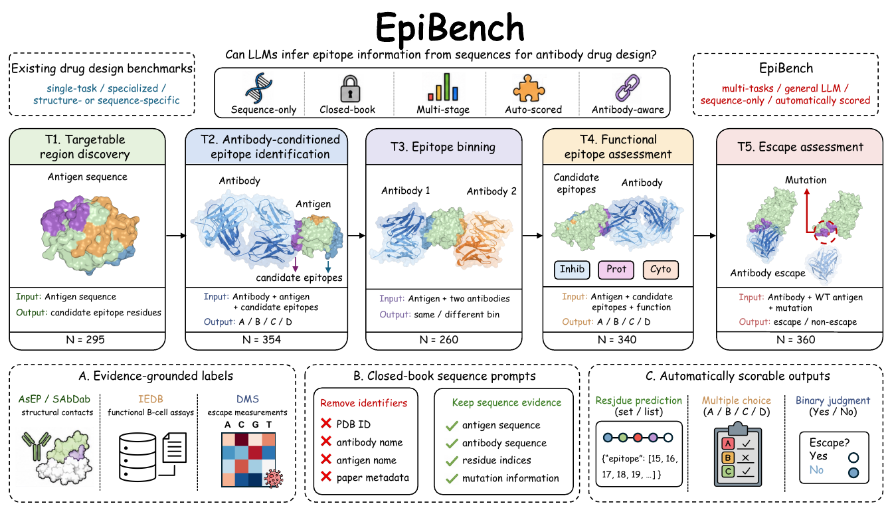
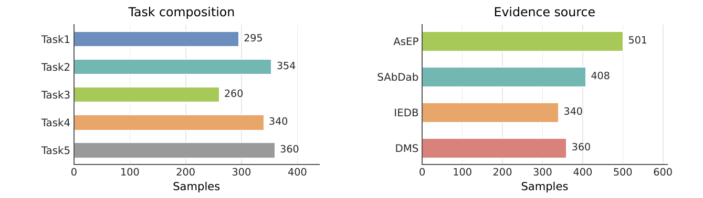
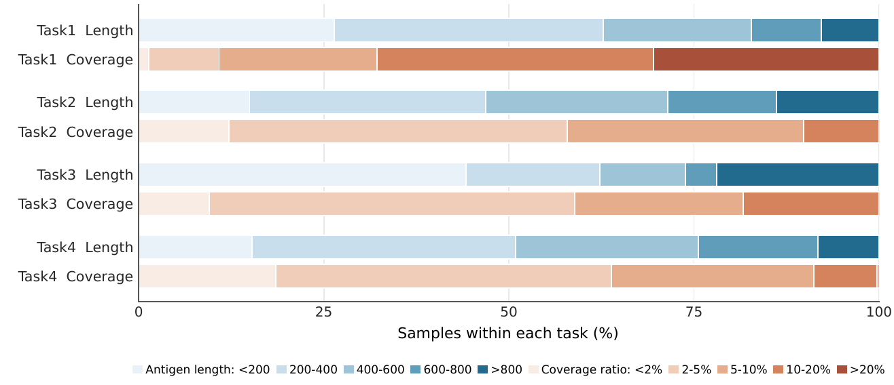

# EpiBench

[Paper](https://arxiv.org/abs/2608.06022) ·
[Hugging Face dataset](https://huggingface.co/datasets/oteam/EpiBench)

A benchmark measuring whether LLMs can locate, prioritize, and reason about **antibody
epitopes and functional binding sites on antigens**, from sequence input alone.



**Benchmark overview (paper Figure 1).** Five tasks connect epitope localization,
antibody-specific recognition, binning, functional assessment, and escape assessment
in a closed-book evaluation.

## Tasks

Five tasks, 1,609 test items, all rated on sequence-only prompts. Antigens are shown
position-numbered (10 residues per line) so a grader can verify indexing.

| task | items | task type | metric | primary_category |
|---|---:|---|---|---|
| task1 | 295 | Antigen-only union-epitope: output ≤50 residue positions on a bare antigen | RegionRecall@50 (α=0.2) | targetable-region count: `1 site`, `2 sites`, `≥3 sites` |
| task2 | 354 | Antibody-conditioned epitope MCQ (A/B/C/D): pick which residue set this antibody binds | Accuracy | antigen taxon: `Viral`, `Bacterial`, `Eukaryote-host`, `Eukaryote-parasite`, `Fungal`, `Archaeal`, `Eukaryote-other`, `Unresolved` |
| task3 | 260 | Epitope binning: do antibodies A & B bind overlapping epitopes on the same antigen? (`same_bin` / `different_bin`) | Balanced accuracy | difficulty: `easy`, `medium`, `hard` |
| task4 | 340 | Functional-epitope prioritization MCQ (A/B/C/D): which candidate epitope has functional-antibody evidence? | Accuracy | mechanism: `inhibition`, `protection`, `cytotoxicity` |
| task5 | 360 | Antibody escape: does mutation X in this antigen region cause the antibody to lose binding? (`escape` / `non_escape`) | Escape accuracy | mutation residue class: `hydrophobic`, `polar`, `pos`, `neg`, `special` |

Total: 1,609 items across 5 test-only splits.

## Dataset at a glance



**Dataset composition (paper Figure 2).** Samples span five tasks and four evidence
sources: AsEP, SAbDab, IEDB, and deep mutational scanning (DMS).



**Sequence distributions (paper Figure 3).** Antigen lengths and epitope coverage
vary across Tasks 1–4. Task 5 uses a fixed antigen window for mutation-specific escape
assessment and does not define an epitope residue set for this coverage analysis.

Figures 1–3 are extracted from [Wang et al. (2026), arXiv:2608.06022v1](https://arxiv.org/abs/2608.06022v1)
under [CC BY 4.0](https://creativecommons.org/licenses/by/4.0/).
PDF page margins and captions were cropped for display; figure content is unchanged.

## Item schema

Every record in `taskN/test.jsonl` shares this envelope:

```jsonc
{
  "id": "asep_st2_0001",          // unique, task-scoped ID
  "task": "task1",
  "primary_category": "≥3 sites", // per-task subcategory (see table above) — for stratified scoring
  "input": {...},                 // task-specific inputs (antigen, antibody, options, mutation, ...)
  "label": {...},                 // gold answer (positions list / letter / same_bin / escape / ...)
  "meta": {...}                   // per-item metadata (species, PDB, tier, cluster, difficulty stats, ...)
}
```

Per-task `input` and `label` shapes:

- **task1** — `input = {antigen}`; `label = {union_epitope_positions:[int], patches:[[int]]}`
- **task2** — `input = {antibody:{H,L,cdr_h,cdr_l}, antigen, options:[4 residue-position lists]}`; `label = {answer:"A|B|C|D", tier}`
- **task3** — `input = {antigen, antibody_A:{...}, antibody_B:{...}}`; `label = {answer:"same_bin|different_bin"}`
- **task4** — `input = {antigen, options:{A|B|C|D:{seq,start,end}}, question_function}`; `label = {answer:"A|B|C|D"}`
- **task5** — `input = {antibody:{...}, antigen, antigen_region, mutation}`; `label = {answer:"escape|non_escape"}`

## Rendering to a chat prompt

This repository ships **raw structured data only** — you convert it into a `{system, user}`
chat prompt yourself via the shipped renderer. Templates and code are in `scripts/`.

Quick render (all 5 tasks -> one rendered.jsonl):

```bash
git clone https://huggingface.co/datasets/oteam/EpiBench
cd EpiBench
python scripts/render_prompts.py   # reads task*/test.jsonl + scripts/prompts/*.txt -> rendered.jsonl
```

Each output line: `{id, task, primary_category, system, user, label, meta}`.

To try a Chain-of-Thought variant or a strict direct-answer variant, edit the template
strings in `scripts/prompts/task{1..5}.txt` and re-run — the renderer is a thin substitution
step (residue numbering, options, CDR blocks are pre-computed).

## Load with 🤗 datasets

```python
from datasets import load_dataset

# One task at a time — each config has a single 'test' split.
ds = load_dataset("oteam/EpiBench", "task2", split="test")
print(ds[0]["id"], ds[0]["primary_category"])
print(ds[0]["input"]["antigen"][:80], "...")
print("gold:", ds[0]["label"]["answer"])
```

## Sources & licensing

Built from public antibody/antigen resources:
- **AsEP** — curated antibody–antigen complexes (MIT license).
- **UniProt** — reviewed antigen sequences and functional-site annotations (CC-BY 4.0).
- **RCSB PDB** — deposited antibody–antigen structures and complex interfaces (public domain).
- **IEDB** — functional-antibody evidence and epitope annotations that back task4.
- **Bloom lab deep-mutational-scanning data** — escape/non-escape labels backing task5.

This benchmark is released under **MIT**. Individual upstream sources retain their own
licenses; when redistributing derived subsets please cite the underlying resource above.
The paper figures in `assets/figures/` retain their **CC BY 4.0** license; see
[figure attribution](assets/figures/README.md).

## Known limitations

- **task1** is intrinsically hard for sequence-only models (it is a docking-like problem).
  Expect near-floor scores; probes a capability upper bound.
- **task2** ground-truth labels come from real complexes plus synthesized distractors
  (`meta.tier` = `A_real` vs `B_synth`).
- **task3** was rebuilt from a previous 327-item version to 260 CDR-similarity-matched
  pairs, so a trivial "are the two antibodies similar?" baseline no longer wins
  (similarity-only baseline dropped 0.81 → 0.65). Report that baseline as a sanity metric.
- **task4** targets well-characterised, often famous functional sites — inherent
  training-data-contamination ceiling.
- **task5** escape/non-escape ratios are based on deep-mutational-scanning thresholds;
  labels are noisy near-threshold.
- No deposition-date / novelty split — low scores cannot be cleanly attributed to
  difficulty vs. contamination.

## Repository layout

```
EpiBench
├── README.md
├── assets/figures/              paper figures and attribution
├── task1/test.jsonl             295 items
├── task2/test.jsonl             354 items
├── task3/test.jsonl             260 items
├── task4/test.jsonl             340 items
├── task5/test.jsonl             360 items
└── scripts/
    ├── build_raw.py             re-generate task*/test.jsonl from upstream sources
    ├── render_prompts.py        raw + prompts/ -> chat-ready {system,user}
    └── prompts/task{1..5}.txt   editable prompt templates
```

## Citation

If you use EpiBench, please cite the paper:

```bibtex
@misc{wang2026epibench,
  title={EpiBench: Can LLMs Understand Epitopes for Antibody Drug Discovery?},
  author={Zirui Wang and Jiaqi Wang and Qinghan Wang and Yuzhi Xu and Gang Du and Tingjun Hou and Odin Zhang},
  year={2026},
  eprint={2608.06022},
  archivePrefix={arXiv},
  primaryClass={cs.CL},
  url={https://arxiv.org/abs/2608.06022}
}
```
